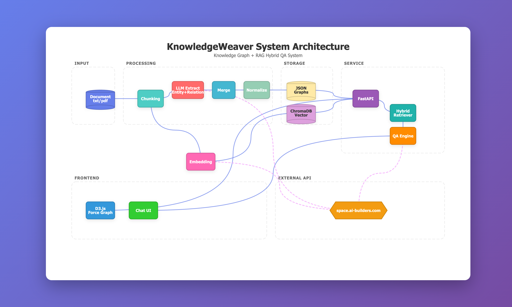

# KnowledgeWeaver

Knowledge Graph + RAG Hybrid Question Answering System

[中文文档](README_CN.md) | English

## Overview

KnowledgeWeaver is an intelligent question-answering system that combines Knowledge Graph (KG) and Retrieval-Augmented Generation (RAG) technologies. The system automatically extracts entities and relationships from documents, builds a knowledge graph, and provides accurate, context-aware answers through a combination of vector retrieval and graph reasoning.

## Core Features

- **Document Processing**: Automatic parsing and chunking of PDF and TXT format documents
- **Knowledge Extraction**: LLM-based entity and relationship extraction
- **Knowledge Graph**: Automatic construction, normalization, and storage of knowledge graphs
- **Hybrid Retrieval**: Combines vector similarity retrieval and graph structure retrieval
- **Intelligent Q&A**: Context-aware question answering based on retrieval results
- **Visualization**: Interactive knowledge graph visualization based on D3.js

## System Architecture



### Processing Pipeline

1. **Input Layer**: Receives documents (txt/pdf)
2. **Processing Layer**:
   - Document chunking
   - LLM entity and relationship extraction
   - Knowledge merging and normalization
3. **Storage Layer**:
   - JSON file storage
   - ChromaDB vector database
4. **Service Layer**:
   - FastAPI backend service
   - Hybrid retriever
   - QA engine
5. **Frontend Layer**:
   - D3.js knowledge graph visualization
   - Chat Q&A interface

## Tech Stack

### Backend
- **FastAPI**: High-performance web framework
- **OpenAI**: LLM integration
- **ChromaDB**: Vector database
- **Jinja2**: Prompt template engine

### Frontend
- **D3.js**: Knowledge graph visualization
- **JavaScript**: Interactive logic

### External Services
- **LLM API**: space.ai-builders.com

### Observability (Optional)
- **Phoenix**: AI observability and evaluation platform (OpenTelemetry-based)
  - [Integration Guide](docs/PHOENIX_INTEGRATION.md)
  - [Comparison with Langfuse](docs/OBSERVABILITY_COMPARISON.md)
- **Langfuse**: LLM observability and monitoring
  - [Setup Guide](docs/LANGFUSE_GUIDE.md)

## Quick Start

### Install Dependencies

```bash
pip install -r requirements.txt
```

### Configure Environment Variables

Create a `.env` file and configure:

```bash
LLM_BINDING_HOST=https://space.ai-builders.com/backend/v1
LLM_BINDING_API_KEY=your_api_key_here
```

### Start Service

```bash
cd backend
python server.py
```

### Process Documents

```bash
python backend/process_book.py
```

## Project Structure

```
KnowledgeWeaver/
├── backend/              # Backend code
│   ├── server.py        # FastAPI service
│   ├── extractor.py     # Knowledge extraction
│   ├── hybrid_retriever.py  # Hybrid retriever
│   ├── qa_engine.py     # QA engine
│   ├── vector_store.py  # Vector storage
│   ├── embedder.py      # Text embedding
│   └── prompts/         # Prompt templates
├── frontend/            # Frontend code
│   ├── kg-config.js     # Graph configuration
│   └── kg-normalizer.js # Graph normalization
├── data/                # Data directory (gitignored)
│   ├── storage/         # Persistent storage
│   │   ├── graphs/      # Knowledge graphs (JSON)
│   │   ├── rag/         # RAG storage
│   │   └── vector_db/   # Vector database (ChromaDB)
│   ├── inputs/          # User uploaded files
│   └── cache/           # Cache data
├── docs/                # Documentation
│   ├── architecture-cn.png      # Architecture diagram (CN)
│   ├── architecture-en.png      # Architecture diagram (EN)
│   ├── architecture-diagram-cn.html  # Interactive diagram (CN)
│   └── architecture-diagram-en.html  # Interactive diagram (EN)
├── logs/                # Log files (gitignored)
└── tests/               # Test cases
```

## Key Features

### Knowledge Graph Normalization
- Entity deduplication and merging
- Relationship standardization
- Information island detection and connection

### Hybrid Retrieval Strategy
- Vector similarity retrieval (RAG)
- Graph structure retrieval (KG)
- Dynamic weight fusion

### Intelligent Q&A
- Context awareness
- Multi-source information integration
- Structured answer generation

## License

MIT License
