# Phoenix & Langfuse 可观测性架构流程图

## 系统架构概览

本文档详细说明 KnowledgeWeaver 项目中 Phoenix 和 Langfuse 两个可观测性工具的运作机制和数据流向。

## 本质：代理/网关模式

**简单理解**：Phoenix 和 Langfuse 本质上都是在应用和 LLM API 之间加了一层"网关"，用于观测和记录所有流量。

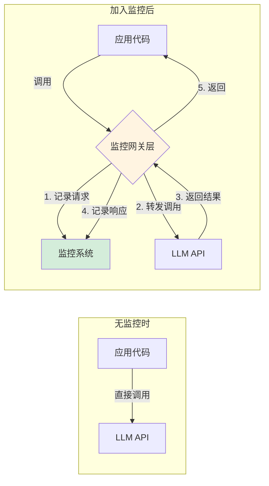
```mermaid
graph LR
    subgraph "无监控时"
        App1[应用代码] -->|直接调用| LLM1[LLM API]
    end

    subgraph "加入监控后"
        App2[应用代码] -->|调用| Gateway{监控网关层}
        Gateway -->|1. 记录请求| Monitor[监控系统]
        Gateway -->|2. 转发调用| LLM2[LLM API]
        LLM2 -->|3. 返回结果| Gateway
        Gateway -->|4. 记录响应| Monitor
        Gateway -->|5. 返回| App2
    end

    style Gateway fill:#fff4e1
    style Monitor fill:#d4edda
```

### 两种网关实现方式

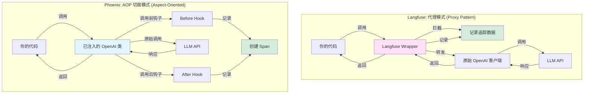
```mermaid
graph TB
    subgraph "Langfuse: 代理模式 (Proxy Pattern)"
        Code1[你的代码] -->|调用| Wrapper[Langfuse Wrapper]
        Wrapper -->|拦截| Record1[记录追踪数据]
        Wrapper -->|转发| Original1[原始 OpenAI 客户端]
        Original1 -->|调用| API1[LLM API]
        API1 -->|响应| Original1
        Original1 -->|返回| Wrapper
        Wrapper -->|记录| Record1
        Wrapper -->|返回| Code1
    end

    subgraph "Phoenix: AOP 切面模式 (Aspect-Oriented)"
        Code2[你的代码] -->|调用| Instrumented[已注入的 OpenAI 类]
        Instrumented -->|调用前钩子| Before[Before Hook]
        Before -->|记录| Record2[创建 Span]
        Instrumented -->|原始调用| API2[LLM API]
        API2 -->|响应| Instrumented
        Instrumented -->|调用后钩子| After[After Hook]
        After -->|记录| Record2
        Instrumented -->|返回| Code2
    end

    style Wrapper fill:#ffe1f5
    style Instrumented fill:#e1f5ff
    style Record1 fill:#d4edda
    style Record2 fill:#d4edda
```

### 类比理解

| 概念 | 传统网络 | 可观测性 |
|------|---------|---------|
| **原始流量** | 客户端 → 服务器 | 应用 → LLM API |
| **网关层** | API Gateway / Nginx | Phoenix / Langfuse |
| **功能** | 路由、限流、鉴权 | 追踪、记录、分析 |
| **实现** | 网络层代理 | 代码层包装/注入 |
| **透明性** | 对客户端透明 | 对业务代码透明 |

**关键区别**：
- **Langfuse**: 显式包装 `client = wrapper.wrap(client)`，像是主动接入网关
- **Phoenix**: 自动注入 `instrument()`，像是网关自动拦截流量

## 完整数据流程图

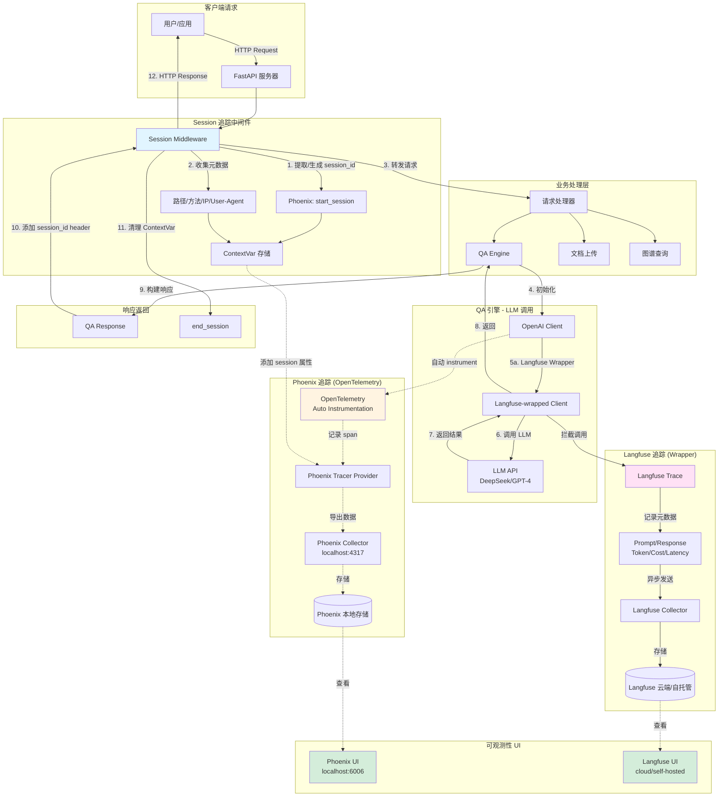
```mermaid
graph TB
    subgraph "客户端请求"
        User[用户/应用] -->|HTTP Request| API[FastAPI 服务器]
    end

    subgraph "Session 追踪中间件"
        API --> SessionMW[Session Middleware]
        SessionMW -->|1. 提取/生成 session_id| SessionStart[Phoenix: start_session]
        SessionMW -->|2. 收集元数据| Metadata[路径/方法/IP/User-Agent]
        SessionStart --> CTX[ContextVar 存储]
        Metadata --> CTX
    end

    subgraph "业务处理层"
        SessionMW -->|3. 转发请求| Handler[请求处理器]
        Handler --> QA[QA Engine]
        Handler --> DOC[文档上传]
        Handler --> GRAPH[图谱查询]
    end

    subgraph "QA 引擎 - LLM 调用"
        QA -->|4. 初始化| Client[OpenAI Client]
        Client -->|5a. Langfuse Wrapper| LFClient[Langfuse-wrapped Client]
        LFClient -->|6. 调用 LLM| LLM[LLM API<br/>DeepSeek/GPT-4]
    end

    subgraph "Phoenix 追踪 (OpenTelemetry)"
        Client -.->|自动 instrument| OTel[OpenTelemetry<br/>Auto Instrumentation]
        OTel -.->|记录 span| Tracer[Phoenix Tracer Provider]
        CTX -.->|添加 session 属性| Tracer
        Tracer -.->|导出数据| Collector[Phoenix Collector<br/>localhost:4317]
        Collector -.->|存储| PhoenixDB[(Phoenix 本地存储)]
    end

    subgraph "Langfuse 追踪 (Wrapper)"
        LFClient -->|拦截调用| LFTrace[Langfuse Trace]
        LFTrace -->|记录元数据| LFMeta[Prompt/Response<br/>Token/Cost/Latency]
        LFMeta -->|异步发送| LFCollector[Langfuse Collector]
        LFCollector -->|存储| LangfuseDB[(Langfuse 云端/自托管)]
    end

    subgraph "响应返回"
        LLM -->|7. 返回结果| LFClient
        LFClient -->|8. 返回| QA
        QA -->|9. 构建响应| Response[QA Response]
        Response -->|10. 添加 session_id header| SessionMW
        SessionMW -->|11. 清理 ContextVar| SessionEnd[end_session]
        SessionMW -->|12. HTTP Response| User
    end

    subgraph "可观测性 UI"
        PhoenixDB -.->|查看| PhoenixUI[Phoenix UI<br/>localhost:6006]
        LangfuseDB -.->|查看| LangfuseUI[Langfuse UI<br/>cloud/self-hosted]
    end

    style SessionMW fill:#e1f5ff
    style OTel fill:#fff4e1
    style LFTrace fill:#ffe1f5
    style PhoenixUI fill:#d4edda
    style LangfuseUI fill:#d4edda
```

## Phoenix 工作原理

### 1. 初始化阶段

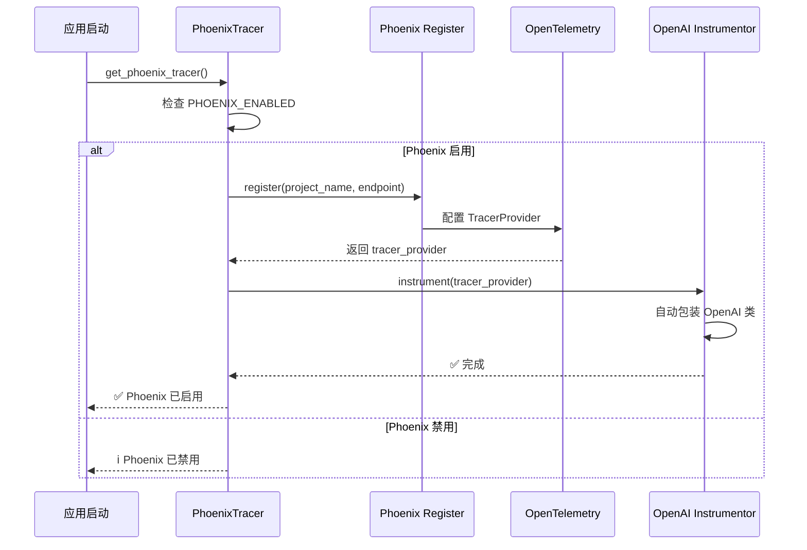
```mermaid
sequenceDiagram
    participant App as 应用启动
    participant PT as PhoenixTracer
    participant Reg as Phoenix Register
    participant OTel as OpenTelemetry
    participant Inst as OpenAI Instrumentor

    App->>PT: get_phoenix_tracer()
    PT->>PT: 检查 PHOENIX_ENABLED
    alt Phoenix 启用
        PT->>Reg: register(project_name, endpoint)
        Reg->>OTel: 配置 TracerProvider
        OTel-->>PT: 返回 tracer_provider
        PT->>Inst: instrument(tracer_provider)
        Inst->>Inst: 自动包装 OpenAI 类
        Inst-->>PT: ✅ 完成
        PT-->>App: ✅ Phoenix 已启用
    else Phoenix 禁用
        PT-->>App: ℹ️ Phoenix 已禁用
    end
```

### 2. Session 追踪流程

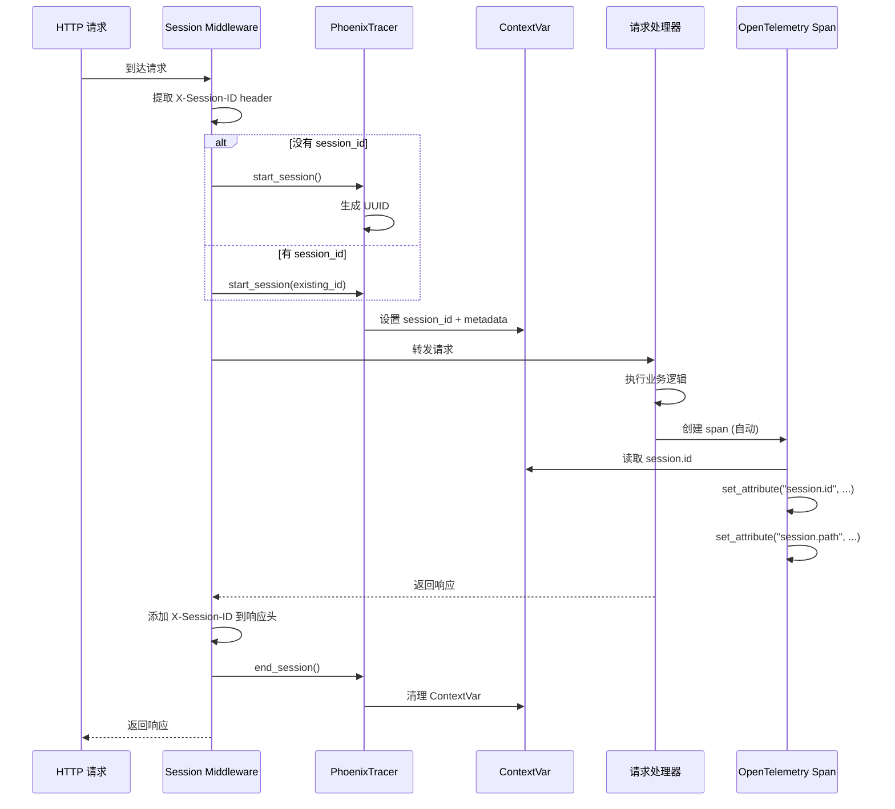
```mermaid
sequenceDiagram
    participant Req as HTTP 请求
    participant MW as Session Middleware
    participant PT as PhoenixTracer
    participant CTX as ContextVar
    participant Handler as 请求处理器
    participant Span as OpenTelemetry Span

    Req->>MW: 到达请求
    MW->>MW: 提取 X-Session-ID header
    alt 没有 session_id
        MW->>PT: start_session()
        PT->>PT: 生成 UUID
    else 有 session_id
        MW->>PT: start_session(existing_id)
    end

    PT->>CTX: 设置 session_id + metadata
    MW->>Handler: 转发请求

    Handler->>Handler: 执行业务逻辑
    Handler->>Span: 创建 span (自动)
    Span->>CTX: 读取 session.id
    Span->>Span: set_attribute("session.id", ...)
    Span->>Span: set_attribute("session.path", ...)

    Handler-->>MW: 返回响应
    MW->>MW: 添加 X-Session-ID 到响应头
    MW->>PT: end_session()
    PT->>CTX: 清理 ContextVar
    MW-->>Req: 返回响应
```

### 3. 自动追踪机制

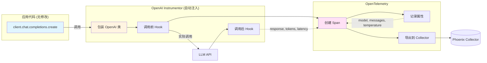
```mermaid
graph LR
    subgraph "应用代码 (无修改)"
        Code[client.chat.completions.create]
    end

    subgraph "OpenAI Instrumentor (自动注入)"
        Wrap[包装 OpenAI 类]
        Before[调用前 Hook]
        After[调用后 Hook]
    end

    subgraph "OpenTelemetry"
        Span[创建 Span]
        Attrs[记录属性]
        Export[导出到 Collector]
    end

    Code -->|调用| Wrap
    Wrap --> Before
    Before --> Span
    Span --> Attrs
    Attrs -.->|model, messages, temperature| Span
    Before -->|实际调用| LLM[LLM API]
    LLM --> After
    After -.->|response, tokens, latency| Span
    Span --> Export
    Export --> Collector[(Phoenix Collector)]

    style Code fill:#e1f5ff
    style Wrap fill:#fff4e1
    style Span fill:#ffe1f5
```

## Langfuse 工作原理

### 1. 初始化和包装

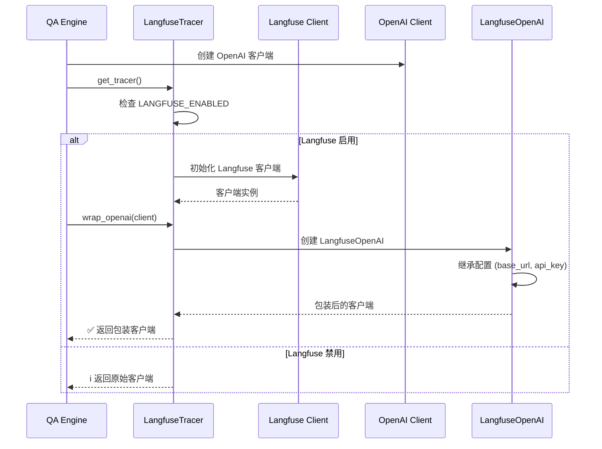
```mermaid
sequenceDiagram
    participant QA as QA Engine
    participant LFT as LangfuseTracer
    participant LF as Langfuse Client
    participant Client as OpenAI Client
    participant Wrapper as LangfuseOpenAI

    QA->>Client: 创建 OpenAI 客户端
    QA->>LFT: get_tracer()
    LFT->>LFT: 检查 LANGFUSE_ENABLED

    alt Langfuse 启用
        LFT->>LF: 初始化 Langfuse 客户端
        LF-->>LFT: 客户端实例
        QA->>LFT: wrap_openai(client)
        LFT->>Wrapper: 创建 LangfuseOpenAI
        Wrapper->>Wrapper: 继承配置 (base_url, api_key)
        Wrapper-->>LFT: 包装后的客户端
        LFT-->>QA: ✅ 返回包装客户端
    else Langfuse 禁用
        LFT-->>QA: ℹ️ 返回原始客户端
    end
```

### 2. LLM 调用追踪

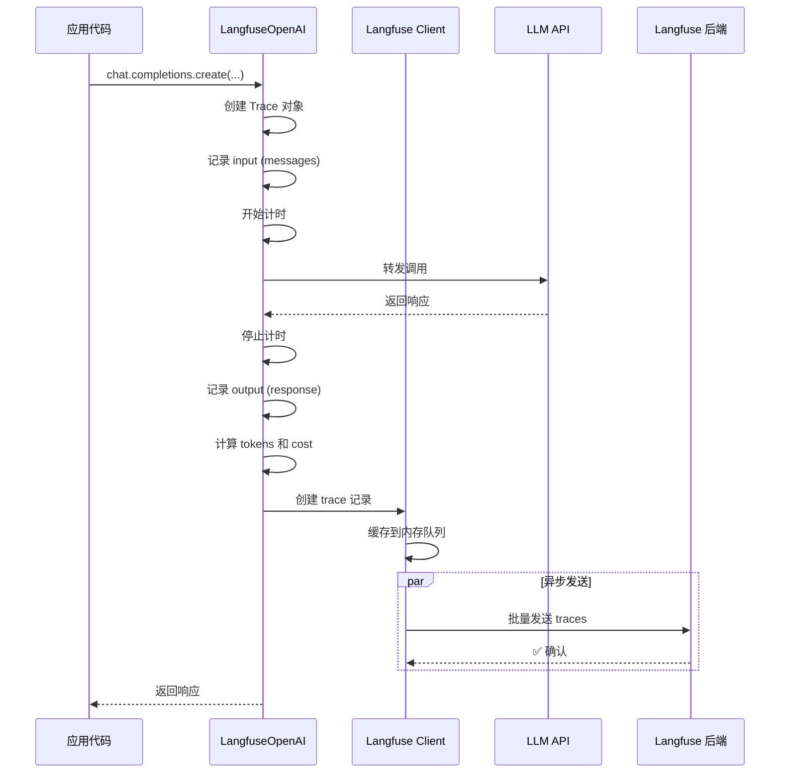
```mermaid
sequenceDiagram
    participant Code as 应用代码
    participant Wrapper as LangfuseOpenAI
    participant LF as Langfuse Client
    participant LLM as LLM API
    participant Backend as Langfuse 后端

    Code->>Wrapper: chat.completions.create(...)
    Wrapper->>Wrapper: 创建 Trace 对象
    Wrapper->>Wrapper: 记录 input (messages)
    Wrapper->>Wrapper: 开始计时

    Wrapper->>LLM: 转发调用
    LLM-->>Wrapper: 返回响应

    Wrapper->>Wrapper: 停止计时
    Wrapper->>Wrapper: 记录 output (response)
    Wrapper->>Wrapper: 计算 tokens 和 cost

    Wrapper->>LF: 创建 trace 记录
    LF->>LF: 缓存到内存队列

    par 异步发送
        LF->>Backend: 批量发送 traces
        Backend-->>LF: ✅ 确认
    end

    Wrapper-->>Code: 返回响应
```

### 3. Flush 机制

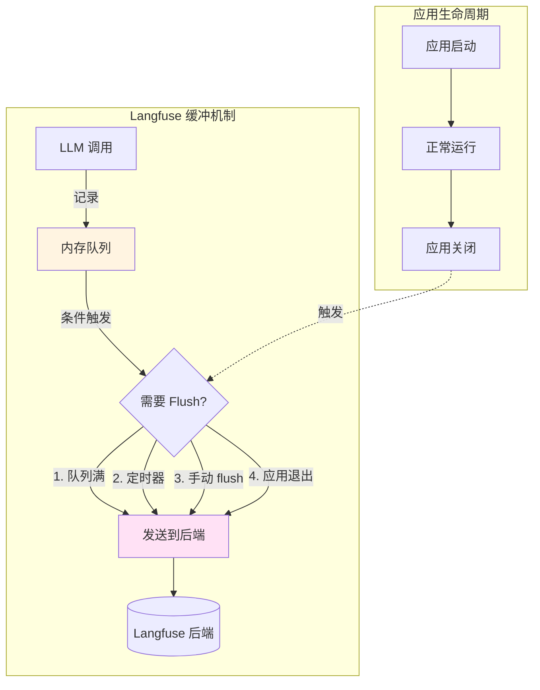
```mermaid
graph TB
    subgraph "应用生命周期"
        Start[应用启动] --> Run[正常运行]
        Run --> Shutdown[应用关闭]
    end

    subgraph "Langfuse 缓冲机制"
        Call[LLM 调用] -->|记录| Queue[内存队列]
        Queue -->|条件触发| Flush{需要 Flush?}
        Flush -->|1. 队列满| Send[发送到后端]
        Flush -->|2. 定时器| Send
        Flush -->|3. 手动 flush| Send
        Flush -->|4. 应用退出| Send
        Send --> Backend[(Langfuse 后端)]
    end

    Shutdown -.->|触发| Flush

    style Queue fill:#fff4e1
    style Send fill:#ffe1f5
```

## 数据对比

### Phoenix vs Langfuse 记录内容

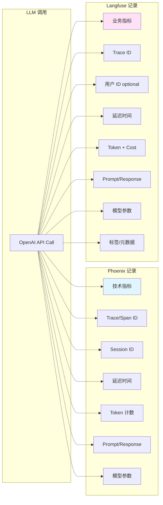
```mermaid
graph LR
    subgraph "LLM 调用"
        Call[OpenAI API Call]
    end

    subgraph "Phoenix 记录"
        P1[技术指标]
        P2[Trace/Span ID]
        P3[Session ID]
        P4[延迟时间]
        P5[Token 计数]
        P6[Prompt/Response]
        P7[模型参数]
    end

    subgraph "Langfuse 记录"
        L1[业务指标]
        L2[Trace ID]
        L3[用户 ID optional]
        L4[延迟时间]
        L5[Token + Cost]
        L6[Prompt/Response]
        L7[模型参数]
        L8[标签/元数据]
    end

    Call -.-> P1
    Call -.-> P2
    Call -.-> P3
    Call -.-> P4
    Call -.-> P5
    Call -.-> P6
    Call -.-> P7

    Call -.-> L1
    Call -.-> L2
    Call -.-> L3
    Call -.-> L4
    Call -.-> L5
    Call -.-> L6
    Call -.-> L7
    Call -.-> L8

    style P1 fill:#e1f5ff
    style L1 fill:#ffe1f5
```

### 数据流向对比

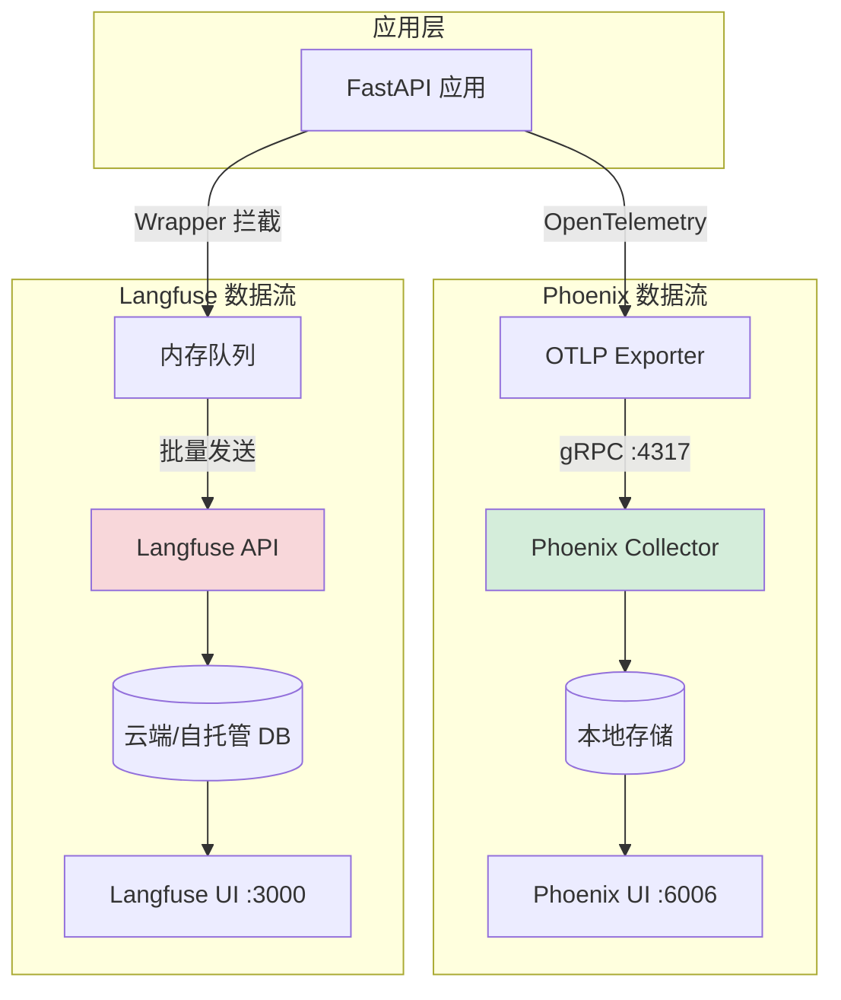
```mermaid
graph TB
    subgraph "应用层"
        App[FastAPI 应用]
    end

    subgraph "Phoenix 数据流"
        App -->|OpenTelemetry| OTLP[OTLP Exporter]
        OTLP -->|gRPC :4317| PC[Phoenix Collector]
        PC --> PDB[(本地存储)]
        PDB --> PUI[Phoenix UI :6006]
    end

    subgraph "Langfuse 数据流"
        App -->|Wrapper 拦截| LFQ[内存队列]
        LFQ -->|批量发送| LFAPI[Langfuse API]
        LFAPI --> LFDB[(云端/自托管 DB)]
        LFDB --> LFUI[Langfuse UI :3000]
    end

    style PC fill:#d4edda
    style LFAPI fill:#f8d7da
```

## Session 追踪详解

### Session 生命周期

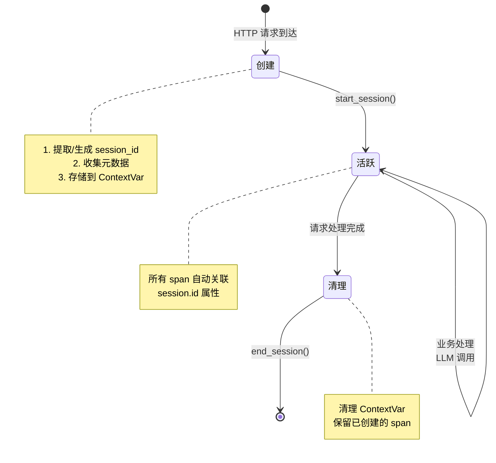
```mermaid
stateDiagram-v2
    [*] --> 创建: HTTP 请求到达
    创建 --> 活跃: start_session()
    活跃 --> 活跃: 业务处理<br/>LLM 调用
    活跃 --> 清理: 请求处理完成
    清理 --> [*]: end_session()

    note right of 创建
        1. 提取/生成 session_id
        2. 收集元数据
        3. 存储到 ContextVar
    end note

    note right of 活跃
        所有 span 自动关联
        session.id 属性
    end note

    note right of 清理
        清理 ContextVar
        保留已创建的 span
    end note
```

### Session 在 Phoenix 中的体现

```mermaid
graph TB
    subgraph "Phoenix UI"
        Projects[项目列表] --> KW[knowledge-weaver]
        KW --> Traces[Traces 页面]
        Traces --> Filter[按 session.id 筛选]
    end

    subgraph "单个 Session 的 Trace"
        Filter --> Session[Session: 550e8400-...]
        Session --> Span1[Span: /qa - 问题1]
        Session --> Span2[Span: /qa - 问题2]
        Session --> Span3[Span: /qa - 问题3]

        Span1 --> LLM1[LLM Call 1]
        Span2 --> LLM2[LLM Call 2]
        Span3 --> LLM3[LLM Call 3]
    end

    subgraph "Span 属性"
        LLM1 -.->|session.id| SID[550e8400-...]
        LLM1 -.->|session.path| PATH[/qa]
        LLM1 -.->|session.method| METHOD[POST]
        LLM1 -.->|session.client_ip| IP[192.168.1.100]
    end

    style Session fill:#d4edda
    style SID fill:#e1f5ff
```

## 配置流程

### 启用流程图

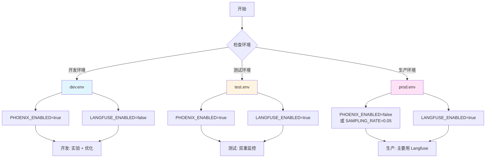
```mermaid
graph TB
    Start[开始] --> CheckEnv{检查环境}

    CheckEnv -->|开发环境| DevConfig[dev.env]
    CheckEnv -->|测试环境| TestConfig[test.env]
    CheckEnv -->|生产环境| ProdConfig[prod.env]

    DevConfig --> Phoenix1[PHOENIX_ENABLED=true]
    DevConfig --> Langfuse1[LANGFUSE_ENABLED=false]

    TestConfig --> Phoenix2[PHOENIX_ENABLED=true]
    TestConfig --> Langfuse2[LANGFUSE_ENABLED=true]

    ProdConfig --> Phoenix3[PHOENIX_ENABLED=false<br/>或 SAMPLING_RATE=0.05]
    ProdConfig --> Langfuse3[LANGFUSE_ENABLED=true]

    Phoenix1 --> DevRun[开发: 实验 + 优化]
    Langfuse1 --> DevRun

    Phoenix2 --> TestRun[测试: 双重监控]
    Langfuse2 --> TestRun

    Phoenix3 --> ProdRun[生产: 主要用 Langfuse]
    Langfuse3 --> ProdRun

    style DevConfig fill:#e1f5ff
    style TestConfig fill:#fff4e1
    style ProdConfig fill:#ffe1f5
```

## 使用场景流程

### 场景 1: 新功能开发

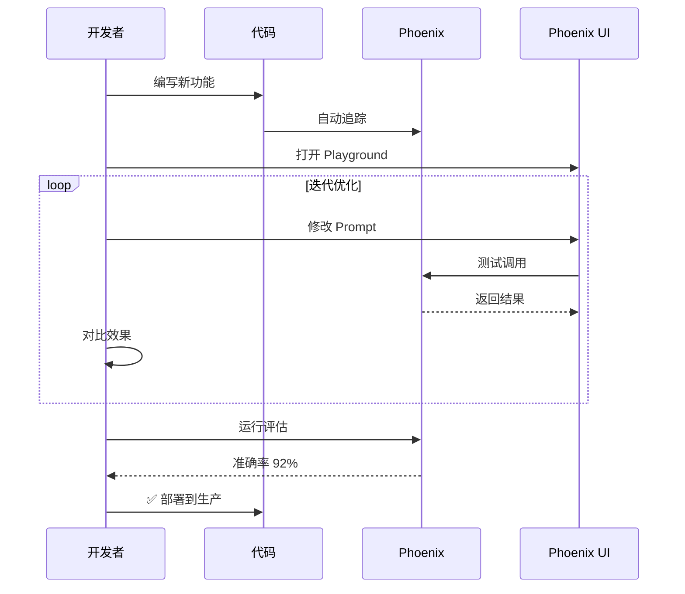
```mermaid
sequenceDiagram
    participant Dev as 开发者
    participant Code as 代码
    participant Phoenix as Phoenix
    participant PUI as Phoenix UI

    Dev->>Code: 编写新功能
    Code->>Phoenix: 自动追踪
    Dev->>PUI: 打开 Playground

    loop 迭代优化
        Dev->>PUI: 修改 Prompt
        PUI->>Phoenix: 测试调用
        Phoenix-->>PUI: 返回结果
        Dev->>Dev: 对比效果
    end

    Dev->>Phoenix: 运行评估
    Phoenix-->>Dev: 准确率 92%
    Dev->>Code: ✅ 部署到生产
```

### 场景 2: 生产问题诊断

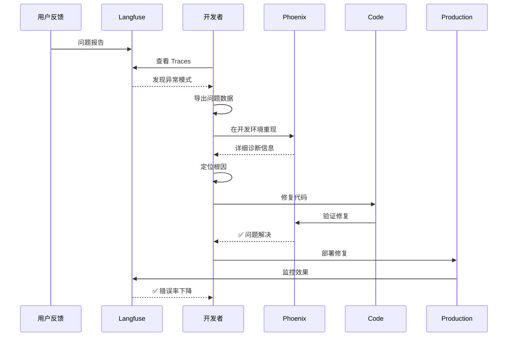
```mermaid
sequenceDiagram
    participant User as 用户反馈
    participant LF as Langfuse
    participant Dev as 开发者
    participant Phoenix as Phoenix

    User->>LF: 问题报告
    Dev->>LF: 查看 Traces
    LF-->>Dev: 发现异常模式
    Dev->>Dev: 导出问题数据

    Dev->>Phoenix: 在开发环境重现
    Phoenix-->>Dev: 详细诊断信息
    Dev->>Dev: 定位根因
    Dev->>Code: 修复代码

    Code->>Phoenix: 验证修复
    Phoenix-->>Dev: ✅ 问题解决
    Dev->>Production: 部署修复
    Production->>LF: 监控效果
    LF-->>Dev: ✅ 错误率下降
```

### 场景 3: 成本优化

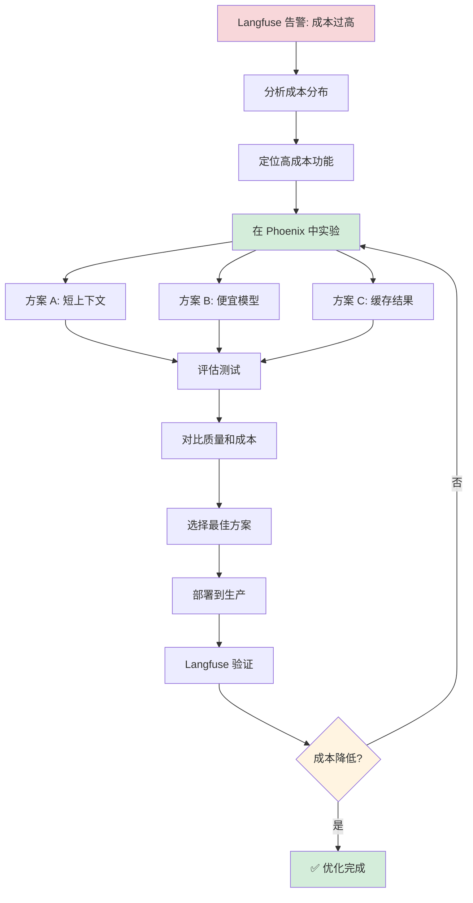
```mermaid
graph TB
    Start[Langfuse 告警: 成本过高] --> Analysis[分析成本分布]
    Analysis --> Identify[定位高成本功能]
    Identify --> Phoenix[在 Phoenix 中实验]

    Phoenix --> Option1[方案 A: 短上下文]
    Phoenix --> Option2[方案 B: 便宜模型]
    Phoenix --> Option3[方案 C: 缓存结果]

    Option1 --> Eval[评估测试]
    Option2 --> Eval
    Option3 --> Eval

    Eval --> Compare[对比质量和成本]
    Compare --> Select[选择最佳方案]
    Select --> Deploy[部署到生产]
    Deploy --> Verify[Langfuse 验证]
    Verify --> Success{成本降低?}

    Success -->|是| End[✅ 优化完成]
    Success -->|否| Phoenix

    style Start fill:#f8d7da
    style Phoenix fill:#d4edda
    style Success fill:#fff4e1
    style End fill:#d4edda
```

## 性能开销对比

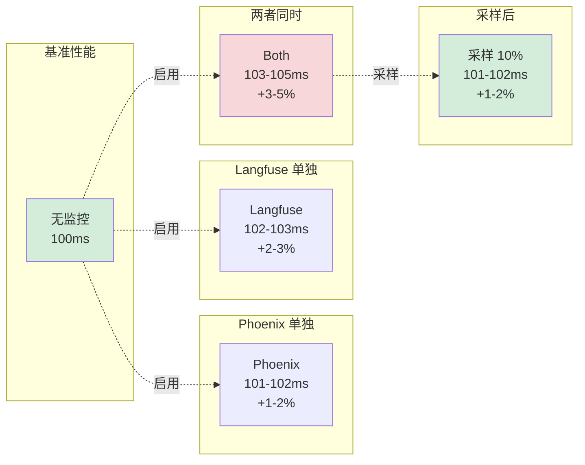
```mermaid
graph LR
    subgraph "基准性能"
        Base[无监控<br/>100ms]
    end

    subgraph "Phoenix 单独"
        P[Phoenix<br/>101-102ms<br/>+1-2%]
    end

    subgraph "Langfuse 单独"
        L[Langfuse<br/>102-103ms<br/>+2-3%]
    end

    subgraph "两者同时"
        Both[Both<br/>103-105ms<br/>+3-5%]
    end

    subgraph "采样后"
        Sample[采样 10%<br/>101-102ms<br/>+1-2%]
    end

    Base -.->|启用| P
    Base -.->|启用| L
    Base -.->|启用| Both
    Both -.->|采样| Sample

    style Base fill:#d4edda
    style Both fill:#f8d7da
    style Sample fill:#d4edda
```

## 技术实现对比

### 代理模式详解

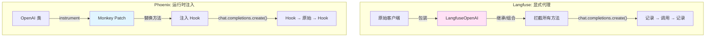
```mermaid
graph TB
    subgraph "Langfuse: 显式代理"
        LF1[原始客户端] -->|包装| LF2[LangfuseOpenAI]
        LF2 -->|继承/组合| LF3[拦截所有方法]
        LF3 -->|"chat.completions.create()"| LF4[记录 → 调用 → 记录]
    end

    subgraph "Phoenix: 运行时注入"
        PH1[OpenAI 类] -->|instrument| PH2[Monkey Patch]
        PH2 -->|替换方法| PH3[注入 Hook]
        PH3 -->|"chat.completions.create()"| PH4[Hook → 原始 → Hook]
    end

    style LF2 fill:#ffe1f5
    style PH2 fill:#e1f5ff
```

### 代码层面对比

**Langfuse 使用（显式）**：
```python
# 1. 创建原始客户端
from openai import OpenAI
client = OpenAI(api_key="...")

# 2. 显式包装（加网关）
from langfuse.openai import OpenAI as LangfuseOpenAI
client = LangfuseOpenAI(api_key="...")  # 替换为代理客户端

# 3. 正常使用（流量经过网关）
response = client.chat.completions.create(...)
# ↑ 这个调用会被 Langfuse 拦截、记录、转发
```

**Phoenix 使用（隐式）**：
```python
# 1. 注册 Phoenix（自动注入网关）
from phoenix.otel import register
register()

# 2. 自动注入追踪（运行时修改 OpenAI 类）
from openinference.instrumentation.openai import OpenAIInstrumentor
OpenAIInstrumentor().instrument()

# 3. 正常使用（流量自动经过网关）
from openai import OpenAI
client = OpenAI(api_key="...")
response = client.chat.completions.create(...)
# ↑ 这个调用会被自动追踪，无需修改代码
```

### 网关层做了什么？

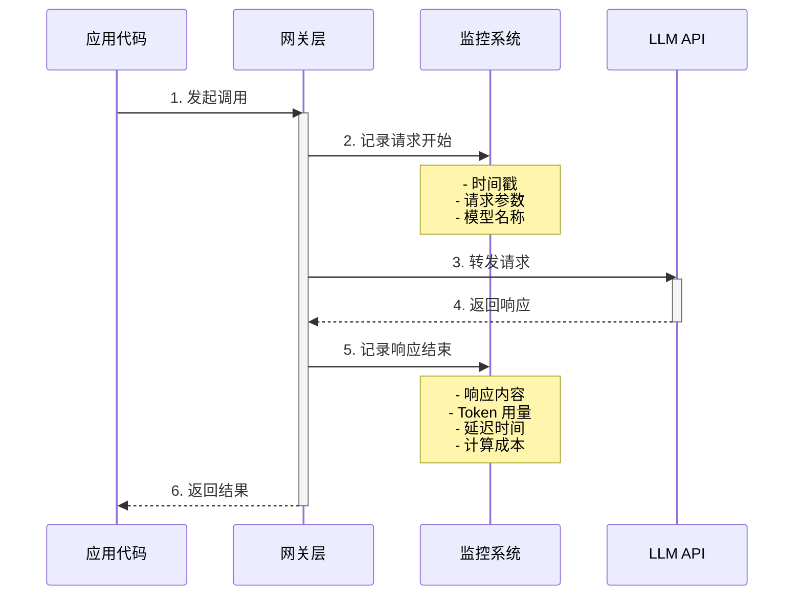
```mermaid
sequenceDiagram
    participant App as 应用代码
    participant Gateway as 网关层
    participant Monitor as 监控系统
    participant LLM as LLM API

    App->>Gateway: 1. 发起调用
    activate Gateway

    Gateway->>Monitor: 2. 记录请求开始
    Note over Monitor: - 时间戳<br/>- 请求参数<br/>- 模型名称

    Gateway->>LLM: 3. 转发请求
    activate LLM
    LLM-->>Gateway: 4. 返回响应
    deactivate LLM

    Gateway->>Monitor: 5. 记录响应结束
    Note over Monitor: - 响应内容<br/>- Token 用量<br/>- 延迟时间<br/>- 计算成本

    Gateway-->>App: 6. 返回结果
    deactivate Gateway
```

### 为什么需要两层网关？

```mermaid
graph LR
    App[应用] -->|调用| L[Langfuse 网关]
    L -->|转发| P[Phoenix 网关]
    P -->|调用| LLM[LLM API]

    L -.->|记录| LDB[(Langfuse DB<br/>业务数据)]
    P -.->|记录| PDB[(Phoenix DB<br/>技术数据)]

    style L fill:#ffe1f5
    style P fill:#e1f5ff
```

**原因**：
- **Langfuse**: 显式包装在最外层，记录业务指标
- **Phoenix**: 运行时注入在内层，自动记录技术指标
- **不冲突**: Phoenix 拦截的是已经被 Langfuse 包装后的调用
- **数据独立**: 两个系统各自记录，互不影响

### 性能开销来源

```mermaid
graph TB
    Call[原始调用 100ms]
    Call -->|Langfuse| L1[+记录请求 1ms]
    L1 --> L2[+序列化数据 1ms]
    L2 --> L3[+队列入队 <1ms]

    Call -->|Phoenix| P1[+创建 Span 1ms]
    P1 --> P2[+记录属性 1ms]
    P2 --> P3[+导出数据 <1ms]

    L3 --> Total[总计: 103-105ms]
    P3 --> Total

    style Call fill:#d4edda
    style Total fill:#fff4e1
```

## LLM 支持范围

### Phoenix 支持的 LLM（几乎全覆盖）

```mermaid
graph TB
    subgraph "直接 SDK 支持"
        OpenAI[OpenAI SDK<br/>GPT-3.5/4/4o]
        Anthropic[Anthropic SDK<br/>Claude Series]
        Bedrock[AWS Bedrock<br/>Claude/Mistral/Llama]
        VertexAI[Google VertexAI<br/>Gemini/PaLM]
        Mistral[MistralAI SDK<br/>Mistral Models]
        LiteLLM[LiteLLM<br/>100+ Providers]
    end

    subgraph "框架支持"
        LangChain[LangChain<br/>所有集成]
        LlamaIndex[LlamaIndex<br/>所有集成]
        Haystack[Haystack]
        DSPy[DSPy]
    end

    subgraph "OpenAI 兼容 API"
        DeepSeek[DeepSeek 深度求索]
        Qwen[Qwen 通义千问]
        GLM[GLM 智谱]
        Moonshot[Moonshot 月之暗面]
        Custom[任何 OpenAI 兼容服务]
    end

    Phoenix[Phoenix 追踪器] -.->|instrument| OpenAI
    Phoenix -.->|instrument| Anthropic
    Phoenix -.->|instrument| Bedrock
    Phoenix -.->|instrument| VertexAI
    Phoenix -.->|instrument| Mistral
    Phoenix -.->|instrument| LiteLLM

    Phoenix -.->|instrument| LangChain
    Phoenix -.->|instrument| LlamaIndex
    Phoenix -.->|instrument| Haystack
    Phoenix -.->|instrument| DSPy

    OpenAI -.->|兼容| DeepSeek
    OpenAI -.->|兼容| Qwen
    OpenAI -.->|兼容| GLM
    OpenAI -.->|兼容| Moonshot
    OpenAI -.->|兼容| Custom

    style Phoenix fill:#d4edda
    style OpenAI fill:#e1f5ff
    style LiteLLM fill:#fff4e1
```

### 当前项目配置

```python
# 项目使用 OpenAI SDK + DeepSeek 后端
from openai import OpenAI

client = OpenAI(
    base_url="https://space.ai-builders.com/backend/v1",  # DeepSeek API
    api_key="...",
)

# Phoenix 的 OpenAIInstrumentor 可以追踪！
# 因为追踪的是客户端调用，不是后端服务
```

### 安装不同 LLM 的 Instrumentor

```bash
# OpenAI (已安装)
pip install openinference-instrumentation-openai

# Anthropic Claude
pip install openinference-instrumentation-anthropic

# AWS Bedrock (支持 Claude, Mistral, Llama 等)
pip install openinference-instrumentation-bedrock

# MistralAI
pip install openinference-instrumentation-mistralai

# LiteLLM (一次性支持 100+ LLM)
pip install openinference-instrumentation-litellm

# LangChain
pip install openinference-instrumentation-langchain

# LlamaIndex
pip install openinference-instrumentation-llama-index
```

### 使用示例

#### 方式 1: OpenAI 兼容 API（当前项目）

```python
from openai import OpenAI

# 任何 OpenAI 兼容的服务都可以被追踪
providers = {
    "deepseek": "https://api.deepseek.com/v1",
    "moonshot": "https://api.moonshot.cn/v1",
    "qwen": "https://dashscope.aliyuncs.com/compatible-mode/v1",
    "glm": "https://open.bigmodel.cn/api/paas/v4",
}

client = OpenAI(
    base_url=providers["deepseek"],
    api_key="..."
)

# Phoenix 自动追踪 ✅
response = client.chat.completions.create(...)
```

#### 方式 2: 直接使用原生 SDK

```python
# Anthropic Claude
from anthropic import Anthropic

# 需要启用: phoenix_tracer.instrument_anthropic()
client = Anthropic(api_key="...")
response = client.messages.create(...)  # 自动追踪 ✅

# AWS Bedrock
import boto3

# 需要启用: phoenix_tracer.instrument_bedrock()
bedrock = boto3.client('bedrock-runtime')
response = bedrock.invoke_model(...)  # 自动追踪 ✅
```

#### 方式 3: 使用 LiteLLM（推荐多 LLM 场景）

```python
from litellm import completion

# 需要启用: phoenix_tracer.instrument_litellm()

# 支持 100+ LLM，统一接口
response = completion(
    model="gpt-4",           # OpenAI
    messages=[...]
)

response = completion(
    model="claude-3-opus",   # Anthropic
    messages=[...]
)

response = completion(
    model="deepseek/deepseek-chat",  # DeepSeek
    messages=[...]
)

# 全部自动追踪 ✅
```

### 兼容性矩阵

| LLM 提供商 | 追踪方式 | 需要安装 | 项目支持 |
|-----------|---------|---------|---------|
| OpenAI | OpenAIInstrumentor | `openinference-instrumentation-openai` | ✅ 已启用 |
| DeepSeek | OpenAIInstrumentor | 无需额外安装（兼容 OpenAI） | ✅ 已支持 |
| Anthropic | AnthropicInstrumentor | `openinference-instrumentation-anthropic` | 📝 已添加方法 |
| AWS Bedrock | BedrockInstrumentor | `openinference-instrumentation-bedrock` | 📝 已添加方法 |
| MistralAI | MistralInstrumentor | `openinference-instrumentation-mistralai` | 📝 已添加方法 |
| LiteLLM | LiteLLMInstrumentor | `openinference-instrumentation-litellm` | 📝 已添加方法 |
| 通义千问 | OpenAIInstrumentor | 无需额外安装（兼容 OpenAI） | ✅ 可直接用 |
| 智谱 GLM | OpenAIInstrumentor | 无需额外安装（兼容 OpenAI） | ✅ 可直接用 |
| 月之暗面 | OpenAIInstrumentor | 无需额外安装（兼容 OpenAI） | ✅ 可直接用 |

### Langfuse 支持的 LLM

Langfuse 通过 wrapper 模式，理论上支持所有 LLM：

```python
# OpenAI 及兼容服务
from langfuse.openai import OpenAI
client = OpenAI(base_url="...", api_key="...")

# Anthropic
from langfuse.anthropic import Anthropic
client = Anthropic(api_key="...")

# LiteLLM
from langfuse.litellm import litellm_wrapper
completion = litellm_wrapper(completion)
```

但 Langfuse 目前主要优化了 OpenAI 的追踪，其他 LLM 可能需要手动配置。

### 推荐方案

```mermaid
graph TB
    Start{使用场景}

    Start -->|单一 LLM| Direct[直接使用原生 SDK]
    Start -->|OpenAI 兼容| OpenAISDK[使用 OpenAI SDK]
    Start -->|多 LLM 切换| LiteLLM[使用 LiteLLM]
    Start -->|框架| Framework[LangChain/LlamaIndex]

    Direct -->|Phoenix| Phoenix1[对应 Instrumentor]
    OpenAISDK -->|Phoenix| Phoenix2[OpenAI Instrumentor]
    LiteLLM -->|Phoenix| Phoenix3[LiteLLM Instrumentor]
    Framework -->|Phoenix| Phoenix4[Framework Instrumentor]

    Direct -->|Langfuse| LF1[原生 Wrapper]
    OpenAISDK -->|Langfuse| LF2[OpenAI Wrapper ✅]
    LiteLLM -->|Langfuse| LF3[LiteLLM Wrapper]
    Framework -->|Langfuse| LF4[手动追踪]

    style OpenAISDK fill:#d4edda
    style LiteLLM fill:#fff4e1
    style Phoenix2 fill:#e1f5ff
```

## 总结

### Phoenix 特点
- ✅ 基于 OpenTelemetry 开放标准
- ✅ **AOP 切面模式**，自动注入，零代码修改
- ✅ 本地部署，完全免费
- ✅ 实验和评估功能强大
- ✅ Session 级别追踪
- ⚠️ 主要用于开发阶段

### Langfuse 特点
- ✅ **代理模式**，显式包装
- ✅ 云端/自托管，数据持久化
- ✅ 成本分析和业务指标
- ✅ 生产监控功能完善
- ⚠️ 需要额外配置

### 网关模式优势
- ✅ **无侵入**：业务代码无需修改（或最小修改）
- ✅ **可插拔**：可以随时启用/禁用
- ✅ **透明化**：对 LLM 调用全面可见
- ✅ **标准化**：基于成熟的设计模式

### 推荐策略
1. **开发**: 只用 Phoenix (AOP 自动追踪，方便实验)
2. **测试**: 两者都启用 (全面监控)
3. **生产**: 主用 Langfuse (显式控制，业务监控)
4. **诊断**: 回到 Phoenix (强大的调试功能)

---

**创建日期**: 2026-01-31
**维护者**: Sheldon
**版本**: 1.0.0
