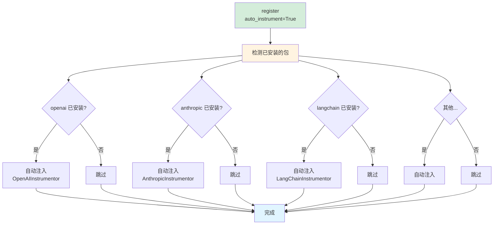

# Phoenix 官方最佳实践

## 官方推荐方式（2026）

根据 [Phoenix 官方文档](https://arize.com/docs/phoenix/tracing/how-to-tracing/setup-tracing/setup-using-phoenix-otel) 和 [API 参考](https://arize-phoenix.readthedocs.io/projects/otel/en/latest/api/register.html)，**官方推荐使用 `auto_instrument=True` 参数**。

### 最简单的方式（官方推荐）

```python
from phoenix.otel import register

# 一行搞定所有自动追踪！
tracer_provider = register(
    auto_instrument=True,  # 🔥 自动检测并注入所有已安装的 Instrumentor
    batch=True,           # 生产环境：批量发送，降低性能开销
    project_name="my-app"
)

# 之后所有 LLM 调用自动追踪，无需任何额外代码！
from openai import OpenAI
client = OpenAI(api_key="...")
client.chat.completions.create(...)  # ✅ 自动追踪

from anthropic import Anthropic
client = Anthropic(api_key="...")
client.messages.create(...)  # ✅ 自动追踪
```

## 项目当前实现（已更新）

```python
# backend/core/phoenix_observability.py (已采用官方推荐方式)
self.tracer_provider = register(
    project_name=project_name,
    endpoint=endpoint,
    auto_instrument=True,  # 官方推荐
    batch=True            # 生产优化
)
```

**优势**：
- ✅ 零手动配置
- ✅ 自动检测所有已安装的 OpenInference Instrumentor
- ✅ 支持的 LLM：OpenAI, Anthropic, Bedrock, MistralAI, LiteLLM, LangChain, LlamaIndex 等
- ✅ 只需安装对应的包，Phoenix 自动追踪

## 配置参数详解

### 基础配置

```python
from phoenix.otel import register

tracer_provider = register(
    # 必选参数
    project_name="my-app",  # 项目名称（在 Phoenix UI 中显示）

    # 推荐参数
    auto_instrument=True,   # 自动注入所有已安装的 Instrumentor
    batch=True,            # 批量发送，提升性能（生产环境推荐）

    # 可选参数
    endpoint="http://localhost:4317",  # Phoenix Collector 地址
    api_key="your-api-key",           # Phoenix Cloud API Key（云端部署）
)
```

### 生产环境配置

```python
from phoenix.otel import register
import os

tracer_provider = register(
    project_name=os.getenv("PHOENIX_PROJECT_NAME", "knowledge-weaver"),
    endpoint=os.getenv("PHOENIX_COLLECTOR_ENDPOINT", "http://localhost:4317"),
    auto_instrument=True,  # 自动追踪
    batch=True,           # 批量发送
    # 可选：采样率（生产环境降低开销）
    # sampler=TraceIdRatioBased(0.1)  # 只追踪 10% 的请求
)
```

### Phoenix Cloud 配置

```python
tracer_provider = register(
    endpoint="https://app.phoenix.arize.com",
    api_key="your-phoenix-cloud-api-key",
    auto_instrument=True,
    batch=True
)
```

## auto_instrument=True 的工作原理



**关键点**：
1. Phoenix 会扫描你的环境
2. 检测哪些 OpenInference Instrumentor 已安装
3. 自动调用 `instrument()` 方法
4. 全部在 `register()` 调用时完成

## 支持的 Instrumentor（自动检测）

安装对应的包后，Phoenix 会自动追踪：

| 包名 | 追踪内容 | 安装命令 |
|------|---------|---------|
| `openinference-instrumentation-openai` | OpenAI SDK | `pip install openinference-instrumentation-openai` |
| `openinference-instrumentation-anthropic` | Anthropic SDK | `pip install openinference-instrumentation-anthropic` |
| `openinference-instrumentation-bedrock` | AWS Bedrock | `pip install openinference-instrumentation-bedrock` |
| `openinference-instrumentation-mistralai` | MistralAI SDK | `pip install openinference-instrumentation-mistralai` |
| `openinference-instrumentation-litellm` | LiteLLM (100+ LLM) | `pip install openinference-instrumentation-litellm` |
| `openinference-instrumentation-langchain` | LangChain | `pip install openinference-instrumentation-langchain` |
| `openinference-instrumentation-llama-index` | LlamaIndex | `pip install openinference-instrumentation-llama-index` |

## 使用示例

### 场景 1: 只用 OpenAI（DeepSeek）

```bash
# 1. 安装 Phoenix 和 OpenAI Instrumentor
pip install arize-phoenix arize-phoenix-otel openinference-instrumentation-openai

# 2. 代码中启用 Phoenix（只需一次）
```

```python
# app.py
from phoenix.otel import register
from openai import OpenAI

# 启用 Phoenix（自动追踪 OpenAI）
register(auto_instrument=True, batch=True)

# 正常使用，自动追踪
client = OpenAI(
    base_url="https://api.deepseek.com/v1",  # DeepSeek API
    api_key="..."
)
response = client.chat.completions.create(
    model="deepseek-chat",
    messages=[{"role": "user", "content": "Hello"}]
)
# ✅ 这个调用会被自动追踪！
```

### 场景 2: 同时用 OpenAI + Anthropic

```bash
# 安装两个 Instrumentor
pip install openinference-instrumentation-openai
pip install openinference-instrumentation-anthropic
```

```python
# app.py
from phoenix.otel import register
from openai import OpenAI
from anthropic import Anthropic

# 一次启用，追踪所有！
register(auto_instrument=True, batch=True)

# OpenAI 调用（自动追踪）
openai_client = OpenAI(api_key="...")
openai_client.chat.completions.create(...)  # ✅ 追踪

# Anthropic 调用（自动追踪）
anthropic_client = Anthropic(api_key="...")
anthropic_client.messages.create(...)  # ✅ 追踪
```

### 场景 3: 使用 LangChain

```bash
pip install openinference-instrumentation-langchain
```

```python
from phoenix.otel import register
from langchain.chains import LLMChain
from langchain.llms import OpenAI

# 启用 Phoenix
register(auto_instrument=True, batch=True)

# LangChain 调用（自动追踪）
llm = OpenAI(temperature=0.9)
chain = LLMChain(llm=llm, prompt=prompt)
chain.run("test")  # ✅ 整个链路自动追踪
```

### 场景 4: 使用 LiteLLM（100+ LLM）

```bash
pip install openinference-instrumentation-litellm
```

```python
from phoenix.otel import register
from litellm import completion

# 启用 Phoenix
register(auto_instrument=True, batch=True)

# 使用任意 LLM，全部自动追踪
completion(model="gpt-4", messages=[...])           # ✅ OpenAI
completion(model="claude-3", messages=[...])        # ✅ Anthropic
completion(model="deepseek-chat", messages=[...])   # ✅ DeepSeek
completion(model="gemini-pro", messages=[...])      # ✅ Google
# 100+ LLM 全部支持！
```

## 对比：官方方式 vs 手动方式

### 官方推荐方式（auto_instrument=True）

```python
# ✅ 推荐：一行搞定
register(auto_instrument=True)

# 添加新 LLM：只需安装包
pip install openinference-instrumentation-anthropic
# 重启服务，自动生效！
```

### 手动方式（不推荐）

```python
# ❌ 不推荐：手动注入每个 Instrumentor
from phoenix.otel import register
from openinference.instrumentation.openai import OpenAIInstrumentor
from openinference.instrumentation.anthropic import AnthropicInstrumentor

tracer = register()
OpenAIInstrumentor().instrument(tracer_provider=tracer)
AnthropicInstrumentor().instrument(tracer_provider=tracer)
# ... 每次添加新 LLM 都要手动添加
```

## 性能优化

### batch=True（生产环境推荐）

```python
# 批量发送，降低性能开销
register(
    auto_instrument=True,
    batch=True  # 🔥 生产环境必备
)
```

**效果**：
- 无 batch: 每次 LLM 调用立即发送追踪数据（~5ms 开销）
- 有 batch: 缓存后批量发送（~1-2ms 开销）

### 采样（高并发场景）

```python
from opentelemetry.sdk.trace.sampling import TraceIdRatioBased

register(
    auto_instrument=True,
    batch=True,
    # 只追踪 10% 的请求
    sampler=TraceIdRatioBased(0.1)
)
```

## 环境变量配置

Phoenix 支持通过环境变量配置（推荐用于生产环境）：

```bash
# .env
PHOENIX_PROJECT_NAME=knowledge-weaver
PHOENIX_COLLECTOR_ENDPOINT=http://localhost:4317

# Phoenix Cloud
PHOENIX_API_KEY=your-cloud-api-key
```

```python
# 自动从环境变量读取
register(auto_instrument=True, batch=True)
```

## 常见问题

### Q: auto_instrument=True 会影响性能吗？
A: 几乎不会。Phoenix 只在启动时检测和注入，之后的追踪开销 < 1-2ms（使用 batch=True）。

### Q: 如果某个 Instrumentor 未安装会报错吗？
A: 不会。Phoenix 会跳过未安装的包，不影响其他功能。

### Q: 能禁用某个 Instrumentor 吗？
A: 可以。不安装对应的包即可，或者使用手动方式（不推荐）。

### Q: 支持哪些 LLM？
A: 几乎所有主流 LLM！包括 OpenAI、Anthropic、Bedrock、MistralAI、DeepSeek、通义千问、智谱等。完整列表见官方文档。

### Q: 为什么项目之前没用 auto_instrument=True？
A: Phoenix 的 `auto_instrument` 参数是后来版本加入的新特性，之前需要手动注入。现在已更新为官方推荐方式。

## 总结

### ✅ 官方最佳实践

```python
from phoenix.otel import register

# 三行代码，搞定所有追踪！
register(
    auto_instrument=True,  # 自动检测并注入
    batch=True            # 生产优化
)
```

### 优势

1. **零配置**：安装包即可，无需手动 instrument
2. **自动化**：Phoenix 自动检测环境
3. **高性能**：batch=True 批量发送
4. **可扩展**：添加新 LLM 只需安装包
5. **官方支持**：跟随 Phoenix 版本更新

---

**参考资料**：
- [Phoenix 官方文档](https://arize.com/docs/phoenix)
- [Setup OTEL - Phoenix](https://arize.com/docs/phoenix/tracing/how-to-tracing/setup-tracing/setup-using-phoenix-otel)
- [Register API Reference](https://arize-phoenix.readthedocs.io/projects/otel/en/latest/api/register.html)
- [Phoenix GitHub](https://github.com/Arize-ai/phoenix)

**创建日期**: 2026-01-31
**维护者**: Sheldon
**版本**: 1.0.0 (官方最佳实践)
